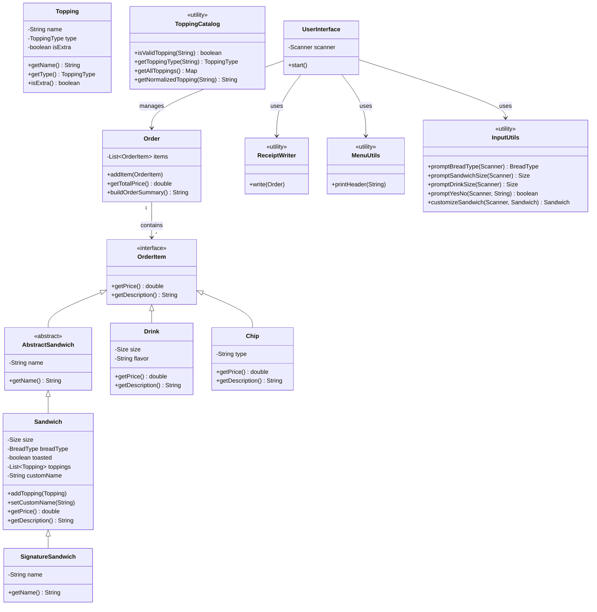

```mermaid
classDiagram
    class OrderItem {
        <<interface>>
        +getPrice() double
        +getDescription() String
    }

    class AbstractSandwich {
        <<abstract>>
        -String name
        +getName() String
    }

    class Sandwich {
        -Size size
        -BreadType breadType
        -boolean toasted
        -List~Topping~ toppings
        -String customName
        +addTopping(Topping)
        +setCustomName(String)
        +getPrice() double
        +getDescription() String
    }

    class SignatureSandwich {
        -String name
        +getName() String
    }

    class Drink {
        -Size size
        -String flavor
        +getPrice() double
        +getDescription() String
    }

    class Chip {
        -String type
        +getPrice() double
        +getDescription() String
    }

    class Topping {
        -String name
        -ToppingType type
        -boolean isExtra
        +getName() String
        +getType() ToppingType
        +isExtra() boolean
    }

    class Order {
        -List~OrderItem~ items
        +addItem(OrderItem)
        +getTotalPrice() double
        +buildOrderSummary() String
    }

    class ToppingCatalog {
        <<utility>>
        +isValidTopping(String) boolean
        +getToppingType(String) ToppingType
        +getAllToppings() Map
        +getNormalizedTopping(String) String
    }

    class ReceiptWriter {
        <<utility>>
        +write(Order)
    }

    class MenuUtils {
        <<utility>>
        +printHeader(String)
    }

    class InputUtils {
        <<utility>>
        +promptBreadType(Scanner) BreadType
        +promptSandwichSize(Scanner) Size
        +promptDrinkSize(Scanner) Size
        +promptYesNo(Scanner, String) boolean
        +customizeSandwich(Scanner, Sandwich) Sandwich
    }

    class UserInterface {
        -Scanner scanner
        +start()
    }

    OrderItem <|-- AbstractSandwich
    AbstractSandwich <|-- Sandwich
    Sandwich <|-- SignatureSandwich
    OrderItem <|-- Drink
    OrderItem <|-- Chip
    Order "1" --> "*" OrderItem : contains
    UserInterface --> Order : manages
    UserInterface --> MenuUtils : uses
    UserInterface --> InputUtils : uses
    UserInterface --> ReceiptWriter : uses
```
