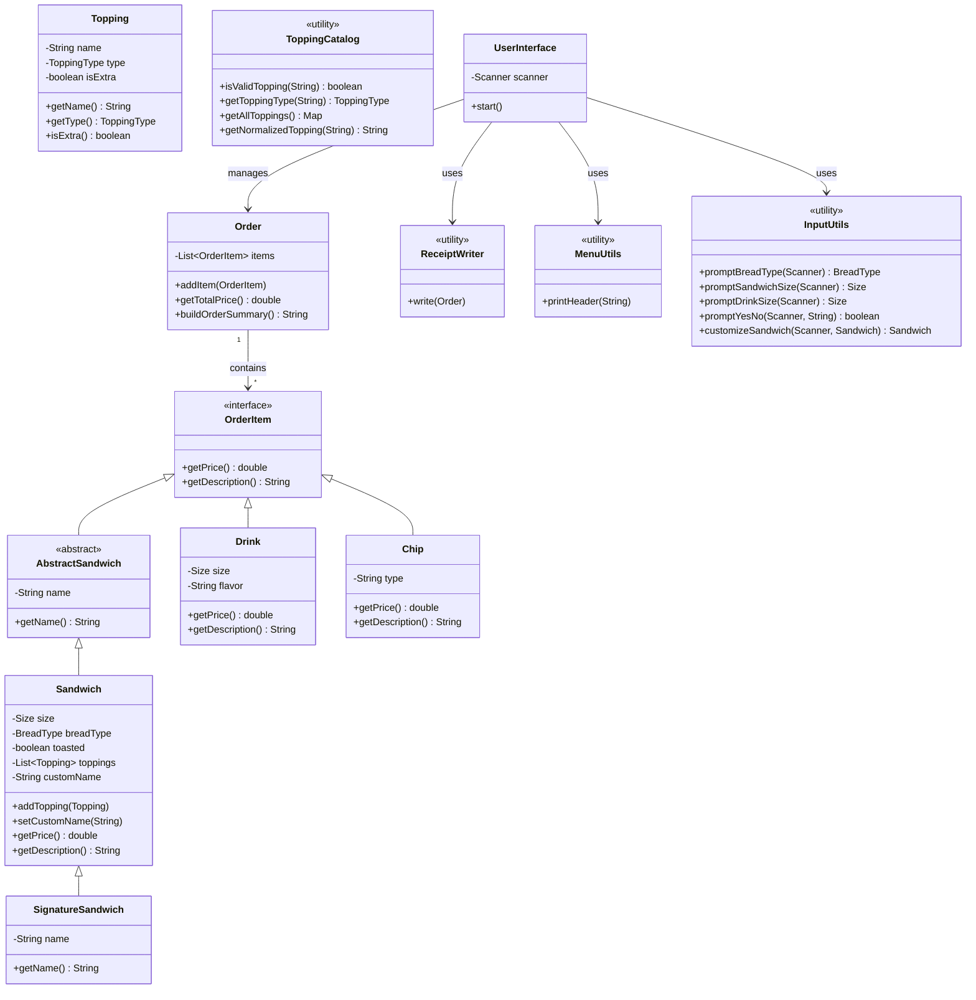

# Delicious POS

Delicious POS is a console-based point-of-sale system written in Java. It allows users to build custom sandwiches, select from a variety of signature subs, add drinks and chips, and generates detailed receipts — all within a streamlined, keyboard-driven interface.

---

## 🔍 Project Overview

This project was developed as part of a capstone assignment to demonstrate core Java programming skills including:

- File input/output (receipt file generation)
- Modular, user-friendly CLI navigation
- Object-oriented design principles
- Input validation and flexible entry control
- Real-world business process simulation
- TreeMap usage for dynamic menu generation

The system records and appends each completed order to a receipt file (`receipt_file.txt`) stored in the project root, providing a real-world feel for receipt tracking.

---

## 🖥️ Screenshots

### Home Screen
> 

---

### Topping Selection Menu
> 

---

### Signature Sandwich Menu
> 

---

### Order Summary / Receipt
> 

---

## 💡 Interesting Feature: Topping Management with `TreeMap`

In a traditional menu system, hardcoding toppings in lists can be inflexible and error-prone.  
To solve this, this project uses a `TreeMap` in the `ToppingCatalog` utility:

```java
private static final Map<String, ToppingType> TOPPING_MAP = new TreeMap<>();

static {
    add("Steak", ToppingType.MEAT);
    add("Ham", ToppingType.MEAT);
    add("Swiss", ToppingType.CHEESE);
    add("Lettuce", ToppingType.REGULAR);
    // ... (more toppings)
}

private static void add(String name, ToppingType type) {
    TOPPING_MAP.put(name, type);
}
```

### 🌟 Why It’s Interesting:
- **Sorted Entries:** `TreeMap` automatically sorts toppings alphabetically, improving user experience in the CLI menu.
- **Dynamic Category Layout:** Toppings are categorized by type (Meat, Cheese, Regular, Sauce, Side) dynamically without hardcoding.
- **Input Validation:** Easy validation of user topping entries with case-insensitive lookup.

This approach improves flexibility and reduces the amount of hardcoded, static menu code — allowing toppings to be added or modified easily with minimal code changes.

---

## 🔭 Technologies Used

- **Java** — core programming language
- **IntelliJ IDEA** — main development environment (IDE)
- **Git & GitHub** — version control system
- **VS Code** — for quick file edits and markdown writing
- **Markdown** — for README and documentation formatting
- **Mermaid.js** — for creating UML diagrams in markdown
- **TreeMap** — Java collection used for sorted data structures
- **Streams API** — used for data transformations (toppings, order items)
- **Lambda Expressions** — used for concise stream processing

---

## 🚀 Getting Started

1. Clone the repository:
   ```bash
   git clone https://github.com/amitmainali/delicious-pos.git
   ```
2. Open the project in IntelliJ IDEA.
3. Run the `Main.java` file.
4. Follow the on-screen menu prompts to create and finalize your order.
5. Completed orders are appended to `receipt_file.txt` in the project root.

---

## 📂 Mermaid UML

